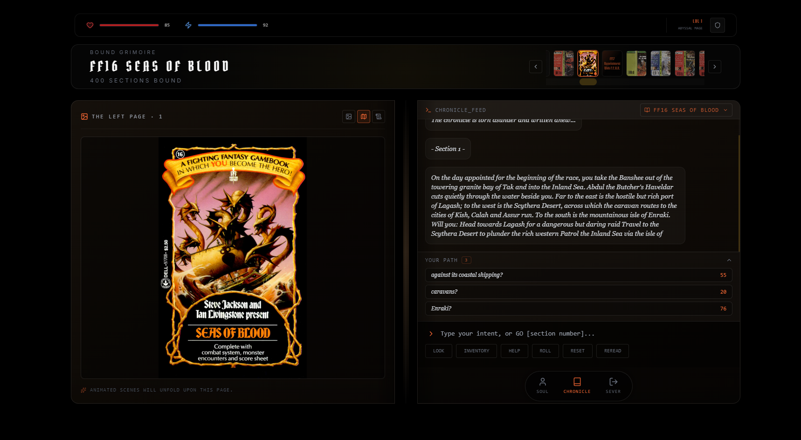
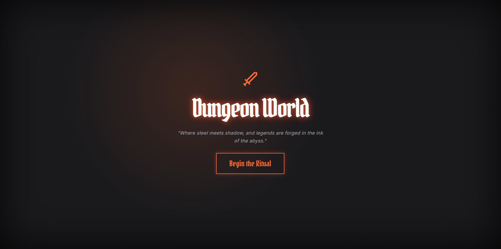
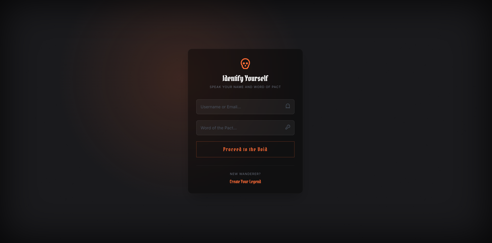
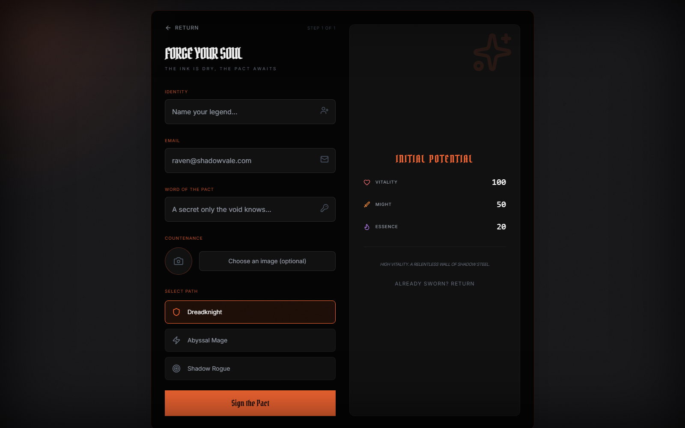
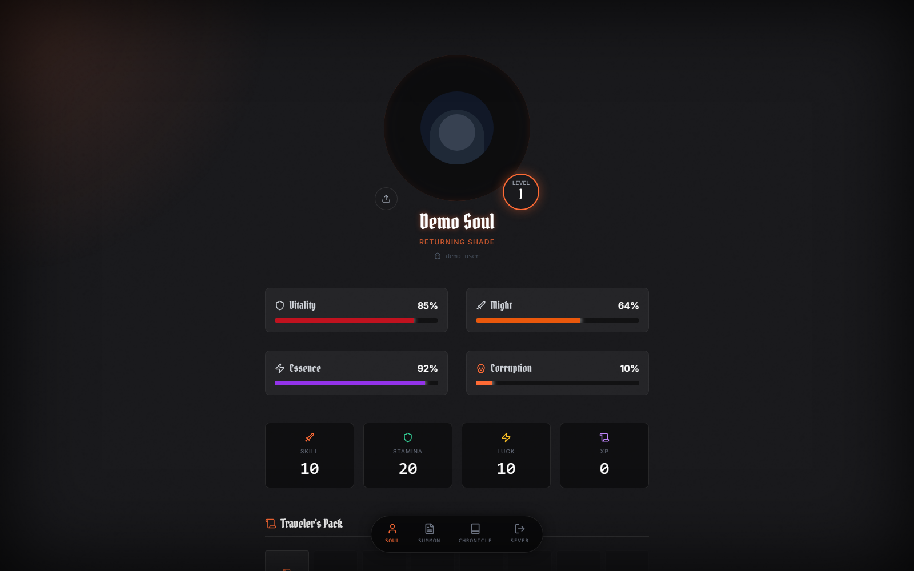
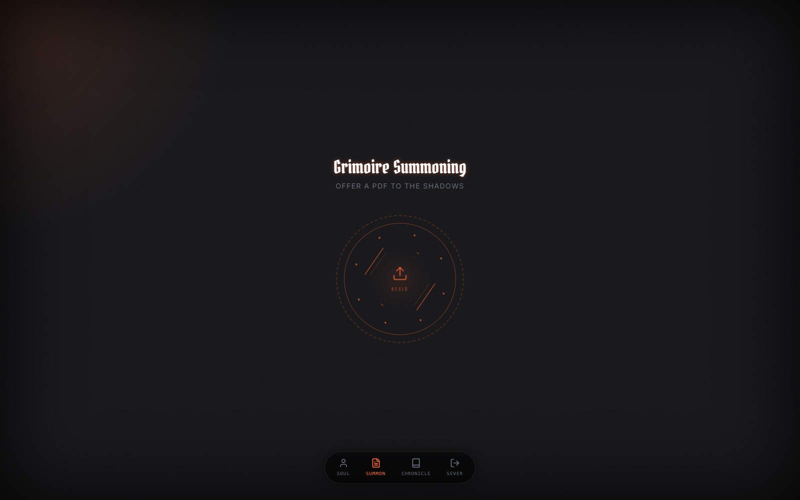
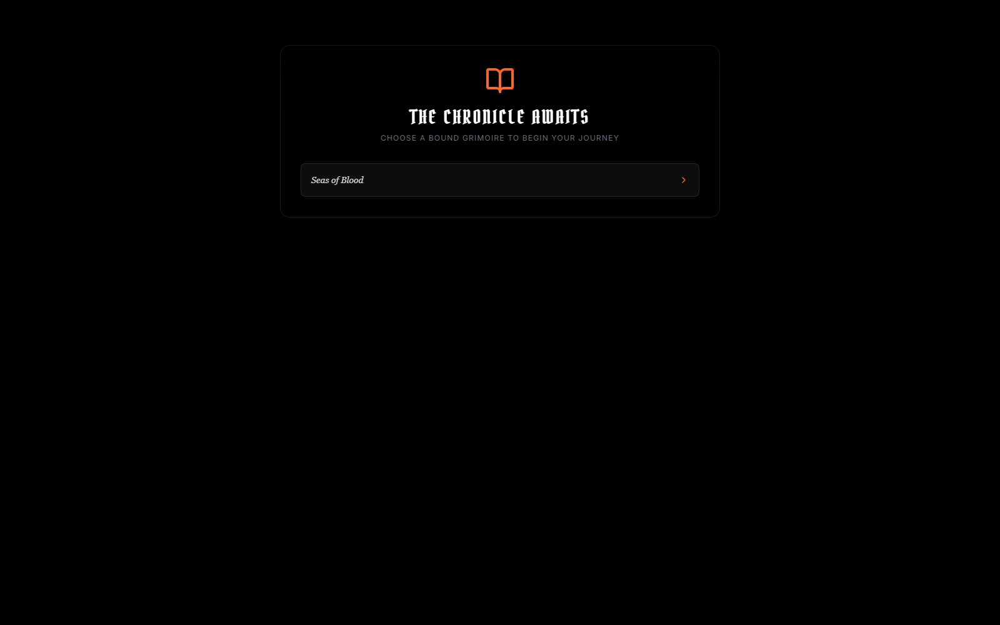
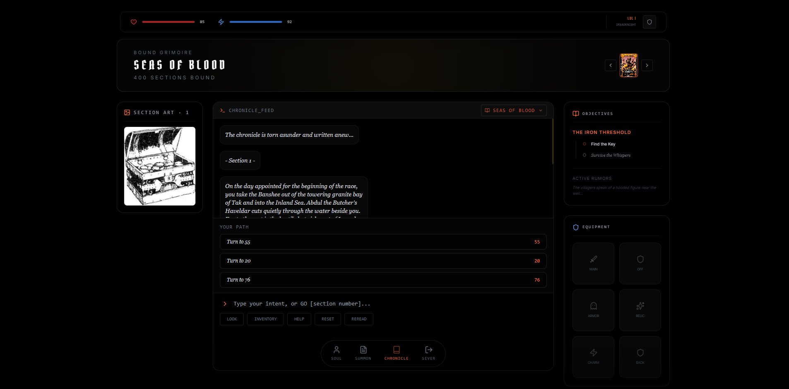

# ⚔️ Dungeon World

> *"Where steel meets shadow, and legends are forged in the ink of the abyss."*



**Dungeon World** is a full-stack web application that digitizes Fighting Fantasy-style gamebook PDFs and lets you play them in a dark-fantasy, atmospheric UI — with real accounts, saved adventures, an inventory, and a growing command language.

It is a single monorepo composed of two applications that talk over HTTP:

```
┌──────────────────────────────┐      /api      ┌──────────────────────────────────────────────┐
│   frontend/  (React + Vite)  │ ◄────────────► │   backend/  (.NET 8 + ASP.NET Core Web API)    │
│   The playable dark-fantasy  │                │   PDF ingestion engine + user/game REST API    │
│   client (Chronicle, Profile)│                │                                              │
└──────────────────────────────┘                │   ├─ DungeonWorld.API           (controllers) │
       │ Vite dev proxy                         │   ├─ DungeonWorld.Infrastructure (parsers,    │
       ▼                                        │   │                               EF Core)    │
  5173 (frontend)                               │   ├─ DungeonWorld.Core           (domain)     │
                                                │   └─ DungeonWorld.Tests          (xUnit)      │
                                                └──────────────┬───────────────────────────────┘
                                                               │
                                              ┌────────────────▼────────────────┐
                                              │  PostgreSQL 16 (dungeonworld)    │
                                              └─────────────────────────────────┘
```

---

## 📦 Repository Layout

| Path | What it is | Read more |
| --- | --- | --- |
| [`frontend/`](frontend/) | React 19 + Vite + Tailwind client — accounts, PDF "Ritual" ingestion, Chronicle reader, character profile | [frontend/README.md](frontend/README.md) |
| [`backend/`](backend/) | .NET 8 Clean-Architecture API — PDF → structured JSON engine, layout-aware parsers, EF Core/PostgreSQL persistence, user & game endpoints | [backend/Readme.md](backend/Readme.md) |
| `compose.yaml` | Root Docker Compose that runs all three services together (Postgres + API + frontend) | — |

## 🚀 Quick Start (Docker)

```bash
docker compose up -d --build
```

That brings up the entire stack:

| Service | URL | Notes |
| --- | --- | --- |
| **frontend** | http://localhost:5173 | The web app |
| **backend** | http://localhost:8080 | REST API + Swagger UI at `/swagger` |
| **postgres** | localhost:5433 | DB `dungeonworld` · user `dw_user` · password `dw_password` |

Then: **Register** an account → visit the **Ritual** to upload a gamebook PDF (the backend parses it automatically) → open the **Chronicle** to start playing.

## 📸 Preview

Live screenshots captured from the app (logged-in session):

| Home | Login | Register |
| --- | --- | --- |
|  |  |  |

| Soul (Profile) | Summon (Ritual) | Chronicle (Reader) |
| --- | --- | --- |
|  |  |  |

| Chronicle Gameplay |
| --- |
|  |

## ✨ Recent Updates

- **Chronicle command language** — `LOOK`, `GO <n>`, `INVENTORY`, `SAVE`, `RESET`, `LOGOUT`, and a formatted `HELP` guide. `RESET` tears the chronicle back to section 1 and re-seals progress; `LOGOUT` plays a cinematic parting ritual before severing the session.
- **Book switcher & grimoire slider** — switch bound adventures from the Chronicle header slider or the feed's "Switch Grimoire" dropdown (auto-saves the current run first).
- **Streamlined Chronicle layout** — left column shows the current section's illustration, the center feed is the terminal, and objectives/equipment sit on the right; the navigation docked directly beneath the command bar.
- **Image-path fix** — double-page books now map illustrations to their *physical* PDF page, fixing broken `/assets/game-art/...` references for existing books (patched in place).

## 🧱 What Each Part Does

### Backend — the engine (`.NET 8`)
- Parses gamebook PDFs into structured JSON (sections, choices, illustrations, map) using PdfPig, with automatic **single-page vs double-page layout detection** and a parser factory that picks the right engine.
- Serves the parsed books through a REST API (`/api/game`, `/api/admin`), with section illustrations served statically at `/assets/game-art`.
- Handles player accounts and progression: PBKDF2-hashed auth, profiles, subscriptions, achievements, assets, and per-book adventure saves — persisted in **PostgreSQL via EF Core**.
- Ships with an xUnit test suite covering layout detection and parser regressions.
- Includes an optional Python **ML_Pipeline** (`pdf_to_images.py`) that renders PDFs to 300-DPI image datasets for OCR/CNN training.

### Frontend — the adventure (React + Vite)
- Fully themed dark-fantasy UI (fog, torchlight, vignette, custom gothic type) with real login/register wired to the backend.
- **The Ritual**: a drag-and-drop "grimoire summoning" screen that uploads a PDF and triggers ingestion.
- **The Chronicle**: a terminal-style reader that plays the book section-by-section — choices, combat prompts, illustrations, and a command language (`GO 42`, `LOOK`, `INVENTORY`, `SAVE`, `RESET`, `LOGOUT`, `HELP`). A grimoire slider and "Switch Grimoire" dropdown let you change books mid-session (auto-saving first).
- **The Profile**: character silhouette, stat bars, a 16-slot Traveler's Pack, saved adventures with resume + progress bars, and earned "Medallion" achievements.
- Cinematic **RitualLoading** (on sign-in) and **LogoutLoading** (parting ritual with randomized farewell phrases) screens.
- Session and character data persist across reloads via `localStorage`.

## 🛠️ Developing Without Docker

Each half runs independently — full instructions in its own README:

```bash
# Backend (needs a local PostgreSQL on port 5433)
cd backend && dotnet run --project DungeonWorld.API

# Frontend (proxies /api → localhost:8080)
cd frontend && npm install && npm run dev
```

## 🧪 Testing

```bash
cd backend && dotnet test DungeonWorldBackend.sln   # xUnit parser/layout suite
cd frontend && npm run lint                          # ESLint
```

## 🗺️ Roadmap

- [x] PDF ingestion → structured, playable game data
- [x] Real user auth + profiles backed by PostgreSQL
- [x] Chronicle reader with section navigation & commands
- [x] Character sheet with pack, achievements, and saved adventures
- [x] Persist chronicle saves to the backend from the reader (`SAVE` / auto-save / book switching)
- [ ] Server-driven inventory grid
- [ ] ML-assisted layout correction via the ML_Pipeline

---

*Crafted in the shadows by Halloul Tarek — Dungeon World (2026)*
